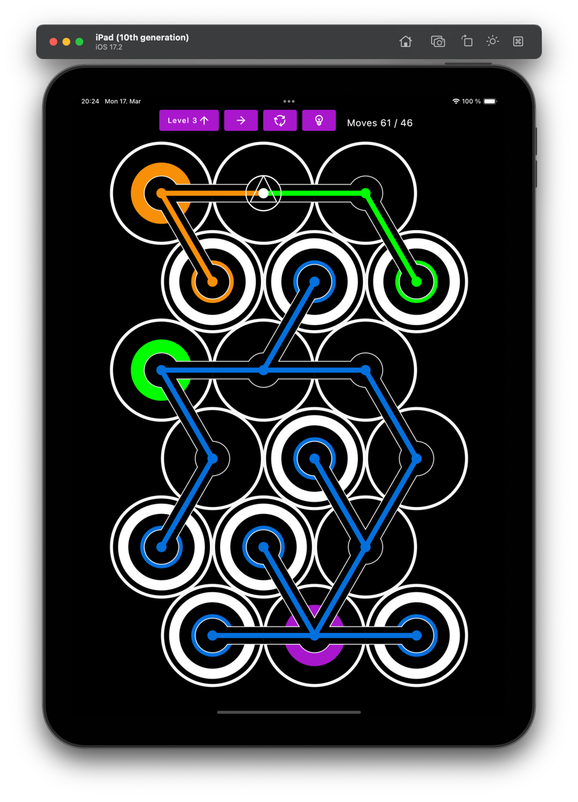
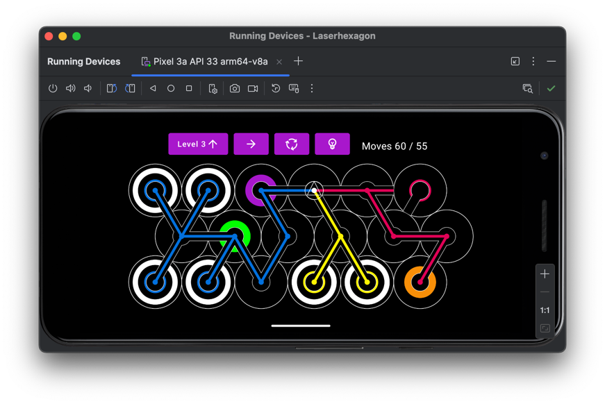
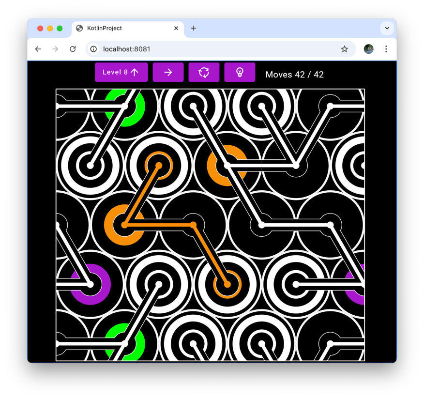
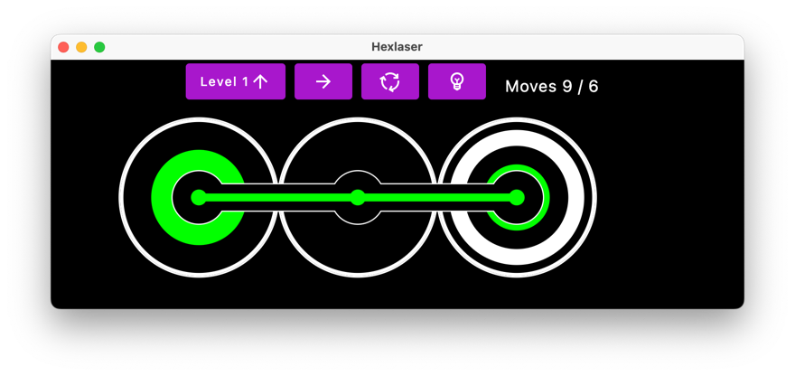

# Hexlaser

is a kmp puzzle game






## run
tests
`./gradlew :shared:allTest :composeApp:allTest`

jvm tests
`./gradlew :shared:jvmTest :composeApp:desktopTest`

desktop
`./gradlew desktopRun -DmainClass=de.nielsfalk.laserhexagon.MainKt`

web 
`./gradlew composeApp:wasmJsBrowserProductionRun  --stacktrace  --info`

ios
```shell
pwd=`pwd` && \
cd iosApp  && \
/Applications/Xcode.app/Contents/Developer/usr/bin/xcodebuild && \
 -project "$pwd/iosApp/iosApp.xcodeproj" && \
 -scheme iosApp  && \
-configuration Debug OBJROOT="$pwd/build/ios" SYMROOT="$pwd/build/ios" && \
-destination id=F6AF6C08-293E-463F-8ADD-378ACB527D28  && \
-allowProvisioningDeviceRegistration -allowProvisioningUpdates
```

## install
macOs
`./gradlew composeApp:packageDmg`

web
```shell
cd build && \
rm -rf downloaded && \
mkdir downloaded && \
cd downloaded && \
wget -r -p -k http://localhost:8080/ && \
wget -r -p -k http://localhost:8080/8433c6b69bfa201b0895.wasm && \
wget -r -p -k http://localhost:8080/composeApp.wasm && \
open .
```

